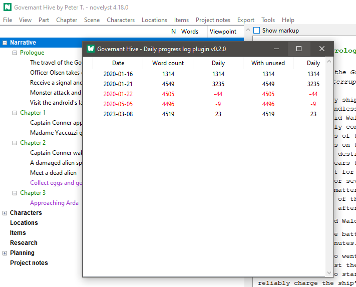

# novelyst_progress

The [novelyst](https://peter88213.github.io/novelyst/) Python program helps authors organize novels.  

*novelyst_progress* is a plugin providing a daily progress log viewer. 

## Features

- Display a list of daily word count log entries.

## Requirements

- [novelyst](https://peter88213.github.io/novelyst/) version 4.18+

## Download and install

[Download the latest release (version 0.2.0)](https://github.com/peter88213/novelyst_progress/raw/main/dist/novelyst_progress_v0.2.0.zip)

- Unzip the downloaded zipfile "novelyst_progress_v0.2.0.zip" into a new folder.
- Move into this new folder and launch **setup.pyw**. This installs the plugin for the local user.
- Open "README.md" for usage instructions.

------------------------------------------------------------------

[Changelog](changelog)

## Usage

See the [instructions for use](usage)

## License

This is Open Source software, and the *novelyst_progress* plugin is licensed under GPLv3. See the
[GNU General Public License website](https://www.gnu.org/licenses/gpl-3.0.en.html) for more
details, or consult the [LICENSE](https://github.com/peter88213/novelyst_progress/blob/main/LICENSE) file.
